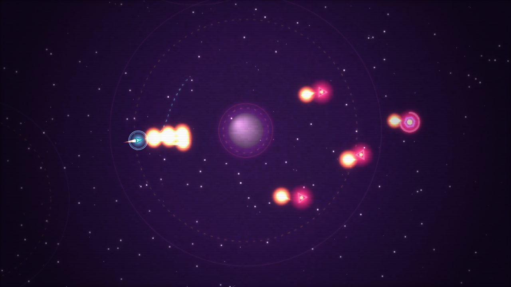

# Whirl

**Fall inward, relight the dark.** A browser-based gravity roguelite — fly a seed-craft on its thrusters through deepening fields of dead worlds, sling around their gravity, and reignite them by holding a clean orbit. Dodge drone swarms, raid relics from deadly orbits, and dive for the Cinder.

### ▶ Play it: https://t3dboy.github.io/whirl/



## Controls
- **Thrust** — hold the mouse / touch (fly toward the cursor), or **↑ / W** with **← / →** to turn
- **Fire** — **Space** / **F** (or the on-screen ◎ button) — missiles arc through gravity, so lead your shots
- **Brake** — **B** — fire the retro-thrusters to bleed off speed and settle an orbit
- **Reignite a world** — hold a clean circular orbit in its gold band
- **Warp deeper** — relight the goal, then fly into the core; or linger to stack your score multiplier

## What's in it
- Custom gravity flight — spheres of influence, orbit-lock reignition, gravity-slung missiles
- Enemies & combat — drone swarms, heavy hulks, manual missiles, a regenerating shield
- Roguelite meta — bank Embers, unlock alternate hulls & weapons, Ascension difficulty, carry a power-up forward
- Drafted power-ups that stack into builds, scaling richer the deeper you fall
- A score-multiplier risk/reward loop: reinforcements escalate the longer you stay
- 12 visual biomes and 14 chiptune tracks — every level a different sky and a different song
- High-score table

## Develop
```bash
npm install
npm run dev      # http://localhost:5174
npm run build    # production build → dist/
npm test         # physics contract tests
```

Built with TypeScript, Vite, Canvas2D, and the Web Audio API — zero runtime dependencies. Deploys to GitHub Pages automatically on push to `main`.
