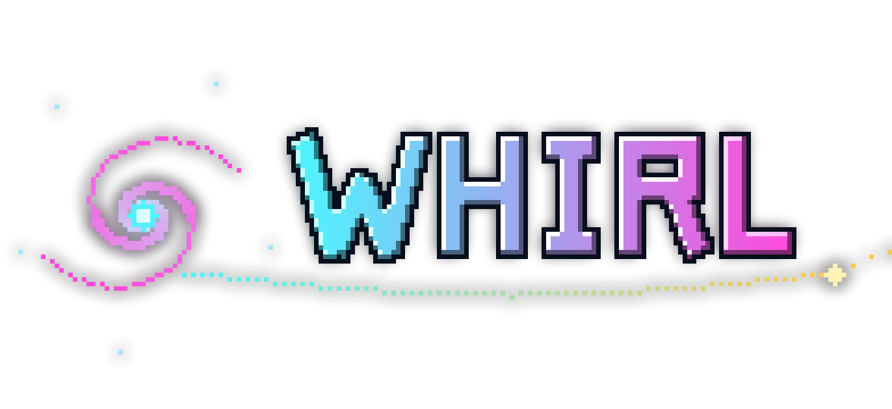
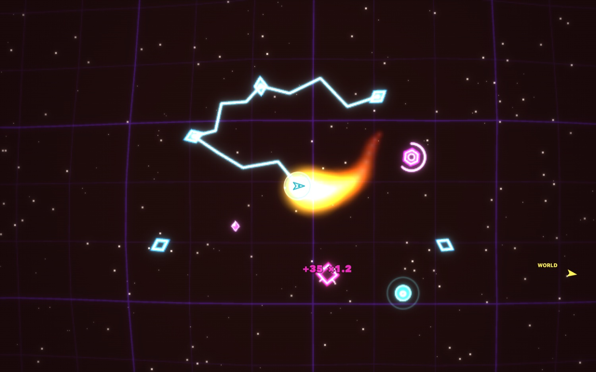
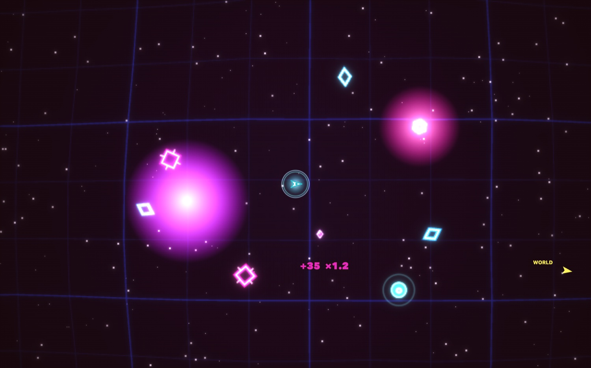

<p align="center">
  
</p>

<p align="center"><strong>Fall inward. Relight the dark.</strong></p>

<p align="center">
  A browser-based gravity roguelite drenched in neon. Fly a craft on its thrusters through
  a dying galaxy, sling yourself around dead worlds, and reignite them by holding the
  perfect orbit — while the swarm closes in.
</p>

<p align="center">
  <a href="https://t3dboy.github.io/whirl/">
    
  </a>
  &nbsp;
  
  &nbsp;
  
</p>

<p align="center"><strong>▶ <a href="https://t3dboy.github.io/whirl/">t3dboy.github.io/whirl</a></strong> — no download, no signup, works on desktop and phone.</p>

[](https://t3dboy.github.io/whirl/)

---

## The pitch

Gravity is not an obstacle. Gravity is the **weapon**.

Every dead world drags at you. Fight it and you'll crash. Work *with* it and you'll whip
around a planet at impossible speed, fling missiles into curving arcs that chase enemies
around the far side, and slingshot into the next system without burning a drop of thrust.

Hold a clean circular orbit inside a world's ignition band and it **blazes back to life**.
Relight enough of them and the core opens — dive through, draft a power-up, pick up a new
weapon, and fall deeper into a darker, meaner sector. Forever. There is no final level;
there's only how deep you dared.

## Look at it

Everything is neon vector line art on a pure black void, sitting on a **warping grid** that
ripples away from your explosions and buckles when a black hole starts to feed.

[](https://t3dboy.github.io/whirl/)

<p align="center"><em>A black hole dragging the entire lattice into itself. You do not want to be here.</em></p>

## What you actually do

**🛸 Fly like it's orbital mechanics, because it is.**
Real spheres of influence. Point-and-thrust with the mouse, or turn-and-burn on the keys.
Retro-thrusters (`B`) to bleed off speed and settle a wobbling orbit. A live ghost line
shows the path your current velocity will trace — read it, and you can fall through a whole
system without touching the throttle.

**🔥 Relight dead worlds.**
Ride a world's gold ignition band with a clean, speed-matched orbit and charge it back to
life. Skim low for extra Charge — but the heat band bites, and the surface kills.

**⚔️ Build an arsenal, mid-run.**
Collect up to **3 auto-firing weapons** per run from the between-sector draft and from rare
weapon crates. Once you're carrying three, every future pick **levels them up** instead.
- **Solar Corona** — a ring of stellar radiation that scorches anything in your orbit
- **Arc Conductor** — ionized bolts that leap from target to target across packed formations
- **Magma Caster** — unstable plasma cores that detonate on impact
- **Rail Needler** — a piercing slug straight through a column of enemies
- **Vibroblade** · **Seeker Darts** · **Drifting Mines** — with more landing every update

**🌀 Or buy the Flame Halo.**
A rotating flamethrower that whirls around your hull, sweeping a swooping tongue of fire
through anything nearby. Level it up and it reaches further, spins faster, and splits into
multiple jets — from a flicker to a roaring inferno.

**💊 Grab powerups mid-fight.**
Eight of them drop from kills: Repair, Overdrive, Time Stop, Nuke, Invulnerability,
Collector, Bounty and Thrust. The first time you touch each one, the game pauses to tell
you exactly what it does.

**💎 Bank Embers, unlock the fleet.**
Dead enemies scatter gems that magnetise toward you. They persist across every session, so
no run is ever wasted. Spend them on five wildly different hulls — the razor-thin **Glass**,
the five-plate **Anchor**, the twin-gun **Comet**, the harvest-doubling **Forge** — and on
better weapons.

**📈 Push your luck.**
Every kill stacks your score multiplier, but reinforcements arrive faster the longer you
linger. Warp early and stay safe, or stay and farm the swarm while it gets genuinely
dangerous. The high-score table is watching.

## Controls

| | |
|---|---|
| **Thrust** | hold **mouse / touch** to fly toward the cursor, or **↑ / W** (turn with **← / →**) |
| **Fire** | **Space** / **F**, or the on-screen ◎ button |
| **Brake** | **B** / **↓** — retro-thrusters to kill speed |
| **Abandon run** | **R** |

## Getting good

- **Don't fight a gravity well — enter it sideways.** Coming in radially means a crash; coming in tangentially means an orbit.
- **Brake into your orbits.** Most failed relights are just too much speed.
- **Your missiles curve.** Near a planet they'll whip right around it. Use that.
- **Shoot their fire out of the sky.** Enemy missiles are dodgeable *and* destructible.
- **Warp with a full shield.** The first ten seconds of a new sector are the scariest.

## Under the hood

- **12 biomes** and **14 chiptune tracks** — Mega Drive–style FM synthesis hand-built from
  oscillators, so every sector is a different sky and a different song
- A **spring-mass warping grid** — thousands of point masses on rubber-band springs, shoved
  by every explosion and sucked in by every black hole
- Deterministic seeded physics, covered by contract tests
- Endless progression — no win screen, just depth

## Develop

```bash
npm install
npm run dev      # http://localhost:5174
npm run build    # production build → dist/
npm test         # physics contract tests
```

TypeScript · Vite · Canvas2D · Web Audio — **zero runtime dependencies**. Auto-deploys to
GitHub Pages on push to `main`.

---

<p align="center">
  <a href="https://t3dboy.github.io/whirl/"><strong>▶ Play Whirl</strong></a><br>
  <sub>Made by Ted Roubour</sub>
</p>
